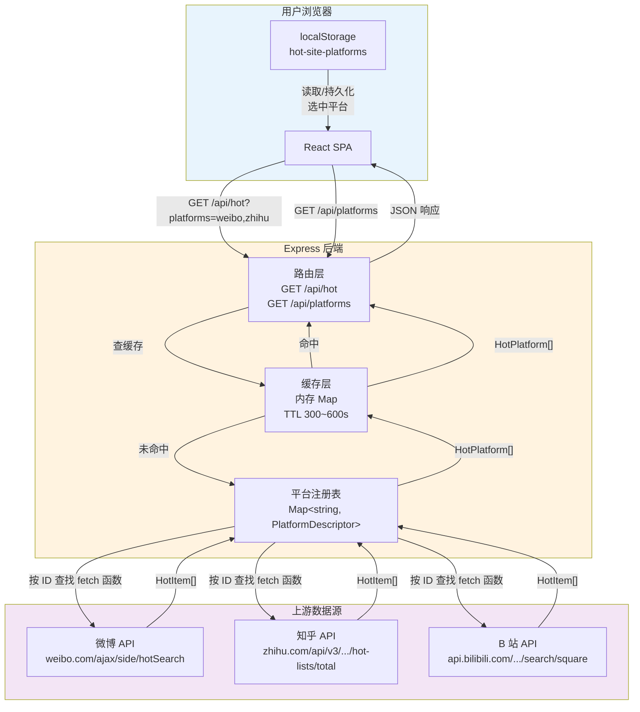

# 多平台热搜聚合网站 · 技术设计文档

---

## 摘要

本文档阐述"今日热搜"多平台热搜聚合网站的技术设计方案。前端采用 React 18 + TypeScript + Vite + CSS Modules 的主流组合，后端采用 Node.js + Express，缓存层使用内存 Map + TTL 的 Cache-Aside 模式。核心架构创新为**平台注册表**：后端维护一份 `Map<string, PlatformDescriptor>`，前端通过 `GET /api/platforms` 获取元数据，用户可自定义启用的平台，偏好持久化至 `localStorage`。布局采用 CSS Grid `auto-fill` + `minmax(320px, 1fr)` 实现列数自适应，缓存键按平台组合生成以确保不同选择互不干扰。

**关键词**：平台注册表；Cache-Aside；CSS Grid auto-fill；TypeScript；前后端契约

---

## 1. 技术选型

### 1.1 前端：React + TypeScript + Vite + CSS Modules

这套组合是当前中小型 Web 项目的主流成熟方案，未使用过于激进的新框架，适合 MVP 快速交付。

| 技术           | 选择理由                                                                                                                                          |
| -------------- | ------------------------------------------------------------------------------------------------------------------------------------------------- |
| React 18       | 生态最成熟、社区最庞大；并发特性（`useTransition`、`Suspense`）为构建流畅用户体验打下基础；`HotCard`、`Layout` 等组件天然适合 React 的组件树结构       |
| TypeScript     | 提前捕获类型错误，让前后端契约更清晰；`HotPlatform`、`HotItem`、`PlatformMeta` 等接口定义是 TS 的核心优势                                           |
| Vite           | 基于原生 ES 模块，冷启动极快，开发时无需等待整个打包过程；`vite.config.ts` 中 proxy 配置简洁，适合频繁调试的场景                                      |
| CSS Modules    | 自动生成唯一类名，零全局碰撞；Vite 开箱即用零配置；项目不强制 UI 库，轻量方案即可                                                                   |

### 1.2 后端：Node.js + Express

| 技术     | 选择理由                                                                                     |
| -------- | -------------------------------------------------------------------------------------------- |
| Node.js  | 与前端同语言，降低认知成本；单线程事件循环模型适合 I/O 密集型的热搜 API 聚合场景                |
| Express  | 最轻量、最成熟的 Node.js Web 框架；社区文档丰富，适合快速搭建 RESTful API                      |

### 1.3 缓存：内存 Map + TTL（Cache-Aside 模式）

使用内存中 `Map<string, { data, ts }>` 作为缓存层，TTL 设为 300～600 秒（5～10 分钟），通过环境变量 `CACHE_TTL` 配置。

**Cache-Aside 流程**：

```
请求 → 检查缓存 → 命中？→ 返回缓存数据
                → 未命中？→ 请求上游 API → 解析 → 写入缓存（设置 TTL）→ 返回
```

**选择理由**：

- 零额外成本（无需 Redis 等外部缓存服务）
- 简单可靠，适合 MVP 阶段
- 各平台对频繁请求敏感（如微博 7 分钟以上缓存可避免限流）

### 1.4 否决方案

| 否决方案                       | 理由                                                             |
| ------------------------------ | ---------------------------------------------------------------- |
| Next.js                        | 纯客户端渲染 SPA，不需要 SSR/SSG；增加构建复杂度                    |
| 数据库（MySQL / MongoDB）      | 缓存无持久化需求；用户偏好存 localStorage，无服务端存储需求          |
| Redux / Zustand                | 全局状态仅"选中平台列表"一项，React 内置 `useState` 完全够用        |
| Tailwind / Bootstrap           | 样式量小，CSS Modules 更轻量且无额外构建依赖                       |
| Puppeteer 爬虫                 | 重型依赖，部署成本高；平台 JSON API 已提供结构化数据                 |
| 第三方热搜付费 API              | 多数收费或不稳定；直接调用平台公开接口更可靠、零成本                 |

---

## 2. 架构设计

### 2.1 数据流架构



**数据流说明**：

```
用户浏览器（React）
    │
    ├─ GET /api/hot?platforms=weibo,zhihu,bilibili
    │
    ▼
Express 后端
    │
    ├─ 缓存层（内存 Map）
    │   ├─ 命中 → 返回缓存数据
    │   └─ 未命中 → 调用上游 API
    │
    ├─ 上游数据源（各平台 JSON API）
    │   ├─ https://weibo.com/ajax/side/hotSearch
    │   ├─ https://zhihu.com/api/v3/feed/topstory/hot-lists/total
    │   └─ https://api.bilibili.com/x/web-interface/wbi/search/square
    │
    └─ 返回统一格式的 HotPlatform[] 响应
```

### 2.2 平台注册表

这是核心架构创新，区别于固定平台列表的竞品方案。注册表是一份元数据集合，后端和前端共享同一份平台定义。

#### 后端结构（含 fetch 函数）

```typescript
// server/registry.ts

interface PlatformDescriptor {
  id:          string;                         // "weibo"
  name:        string;                         // "微博热搜"
  icon:        string;                         // "🔥"
  color:       string;                         // "#e6162d"
  description: string;                         // "新浪微博实时热搜榜"
  enabled:     boolean;                        // 是否默认启用
  fetch:       () => Promise<HotItem[]>;       // 后端专属，不暴露给前端
}

const PLATFORM_REGISTRY = new Map<string, PlatformDescriptor>([
  ["weibo",    { id: "weibo",    name: "微博热搜", icon: "🔥", color: "#e6162d", enabled: true,  fetch: fetchWeibo    }],
  ["zhihu",    { id: "zhihu",    name: "知乎热榜", icon: "💡", color: "#0066ff", enabled: true,  fetch: fetchZhihu    }],
  ["bilibili", { id: "bilibili", name: "B站热搜",  icon: "📺", color: "#fb7299", enabled: true,  fetch: fetchBilibili }],
]);
```

#### 前端元数据（不含 fetch 函数）

```typescript
// GET /api/platforms 的响应体

interface PlatformMeta {
  id:          string;    // "weibo"
  name:        string;    // "微博热搜"
  icon:        string;    // "🔥"
  color:       string;    // "#e6162d"
  description: string;    // "新浪微博实时热搜榜"
  enabled:     boolean;   // 是否默认启用
}
```

**关键设计点**：

- 前端通过 `GET /api/platforms` 获取注册表元数据（不含 `fetch` 函数）
- 用户勾选平台后，前端只请求选中的平台（如 `?platforms=weibo,zhihu`）
- 新增平台只需在注册表中添加条目 + 实现 fetch 函数，无需改路由

### 2.3 动态路由设计

| 路由                             | 方法 | 说明                                                             |
| -------------------------------- | ---- | ---------------------------------------------------------------- |
| `GET /api/platforms`             | GET  | 返回平台注册表元数据，供前端渲染"管理平台"面板                      |
| `GET /api/hot?platforms=a,b,c`   | GET  | 按查询参数获取指定平台数据；缺省 `platforms` 时返回默认启用平台      |
| `GET /api/hot/:source`           | GET  | 获取单个平台数据，用于手动刷新单张卡片                              |

**缓存键设计**：从固定的 `"hot"` 变为 `"hot:{sorted_ids}"`（如 `"hot:bilibili,weibo,zhihu"`），确保不同平台组合各有独立缓存。排序后拼接确保 `?platforms=weibo,zhihu` 和 `?platforms=zhihu,weibo` 命中同一缓存。

### 2.4 自适应布局方案

使用 CSS Grid 的 `auto-fill` + `minmax` 实现自动适配，无需硬编码列数：

```css
.grid {
  display: grid;
  grid-template-columns: repeat(auto-fill, minmax(320px, 1fr));
  gap: 20px;
}
```

| 平台数 | 桌面端（>1000px）          | 平板端（640–1000px） | 手机端（<640px） |
| ------ | -------------------------- | -------------------- | ---------------- |
| 1      | 1 列居中                   | 1 列                 | 1 列全宽         |
| 2      | 2 列                       | 2 列                 | 1 列             |
| 3      | 3 列                       | 2 列                 | 1 列             |
| 4+     | auto-fill（最多约 3 列）   | auto-fill            | 1 列             |

---

## 3. 前后端契约

### 3.1 数据模型定义

#### 单品：`HotItem`

```typescript
interface HotItem {
  rank:  number;   // 排名序号（从 1 开始）
  title: string;   // 热搜标题
  heat?: string;   // 热度值（各平台格式不同，前端统一格式化）
  url:   string;   // 可直接跳转的源站链接
}
```

#### 接口响应：`HotPlatform`

```typescript
// GET /api/hot?platforms=weibo,zhihu 的响应体中 data 数组的元素
interface HotPlatform {
  source:     string;     // 平台标识，"weibo" | "zhihu" | "bilibili"
  sourceName: string;     // 展示名称，"微博热搜"
  listName:   string;     // 榜单名称，"热搜榜"
  updatedAt:  string;     // 更新时间，ISO 8601 格式
  items:      HotItem[];  // 热搜条目列表
  error?:     boolean;    // 该平台是否获取失败
  message?:   string;     // 错误信息
}
```

#### 顶层响应

```typescript
// GET /api/hot?platforms=... 的完整响应体
interface HotResponse {
  ok:     boolean;
  cached: boolean;
  data:   HotPlatform[];
}
```

#### 平台注册表元数据：`PlatformMeta`

```typescript
// GET /api/platforms 的响应体
interface PlatformsResponse {
  ok:   boolean;
  data: PlatformMeta[];
}

interface PlatformMeta {
  id:          string;    // "weibo"
  name:        string;    // "微博热搜"
  icon:        string;    // "🔥"
  color:       string;    // "#e6162d"
  description: string;    // "新浪微博实时热搜榜"
  enabled:     boolean;   // 是否默认启用
}
```

### 3.2 各平台字段映射

| 平台     | API 端点                                                               | `rank` 来源              | `title` 来源                 | `heat` 来源                 | `url` 拼接规则                               |
| -------- | ---------------------------------------------------------------------- | ------------------------ | ---------------------------- | --------------------------- | -------------------------------------------- |
| `weibo`  | `weibo.com/ajax/side/hotSearch`（需 Referer）                           | `data.realtime[].rank`   | `.word` 或 `.note`           | `.raw_hot` → 字符串          | `s.weibo.com/weibo?q={word}`                 |
| `zhihu`  | `zhihu.com/api/v3/feed/topstory/hot-lists/total?limit=50`（需 UA）     | 数组索引 + 1             | `.target.title`              | `.detail_text` → 字符串      | `.target.url`（相对路径补全 `zhihu.com` 前缀） |
| `bilibili` | `api.bilibili.com/x/web-interface/wbi/search/square?limit=50`        | 数组索引 + 1             | `.show_name` 或 `.keyword`   | `.heat_score` → 字符串      | `search.bilibili.com/all?keyword={keyword}`   |

### 3.3 约定说明

| 契约项     | 约定内容                                                                                   |
| ---------- | ------------------------------------------------------------------------------------------ |
| 数据格式   | 统一返回 JSON，`Content-Type: application/json`                                              |
| 错误处理   | 每个平台独立错误状态（`error` + `message`），一个平台失败不影响其他平台                        |
| 时间格式   | 全部使用 ISO 8601 字符串（如 `"2026-07-31T12:00:00Z"`）                                      |
| URL 处理   | 后端补全相对路径（如知乎），保证前端 `url` 字段可直接跳转                                      |
| 热度值     | 各平台格式不同，后端不做统一格式化，保留原始字符串，前端按需渲染                                |

### 3.4 接口 JSON 示例

#### 3.4.1 `GET /api/platforms` — 成功

```json
{
  "ok": true,
  "data": [
    {
      "id": "weibo",
      "name": "微博热搜",
      "icon": "🔥",
      "color": "#e6162d",
      "description": "新浪微博实时热搜榜",
      "enabled": true
    },
    {
      "id": "zhihu",
      "name": "知乎热榜",
      "icon": "💡",
      "color": "#0066ff",
      "description": "知乎全站热榜",
      "enabled": true
    },
    {
      "id": "bilibili",
      "name": "B站热搜",
      "icon": "📺",
      "color": "#fb7299",
      "description": "哔哩哔哩搜索热门",
      "enabled": true
    }
  ]
}
```

#### 3.4.2 `GET /api/hot?platforms=weibo,zhihu` — 全部成功

```json
{
  "ok": true,
  "cached": false,
  "data": [
    {
      "source": "weibo",
      "sourceName": "微博热搜",
      "listName": "热搜榜",
      "updatedAt": "2026-07-31T12:00:00Z",
      "items": [
        { "rank": 1, "title": "某热门话题引爆全网讨论", "heat": "1523421", "url": "https://s.weibo.com/weibo?q=%E6%9F%90%E7%83%AD%E9%97%A8%E8%AF%9D%E9%A2%98" },
        { "rank": 2, "title": "某明星最新动态", "heat": "1203456", "url": "https://s.weibo.com/weibo?q=%E6%9F%90%E6%98%8E%E6%98%9F" },
        { "rank": 3, "title": "某科技公司发布新品", "heat": "987654", "url": "https://s.weibo.com/weibo?q=%E6%9F%90%E7%A7%91%E6%8A%80%E5%85%AC%E5%8F%B8" }
      ]
    },
    {
      "source": "zhihu",
      "sourceName": "知乎热榜",
      "listName": "热榜",
      "updatedAt": "2026-07-31T12:00:01Z",
      "items": [
        { "rank": 1, "title": "如何看待某社会事件？", "heat": "1000 万热度", "url": "https://www.zhihu.com/question/12345678" },
        { "rank": 2, "title": "某行业未来发展趋势是什么？", "heat": "800 万热度", "url": "https://www.zhihu.com/question/23456789" },
        { "rank": 3, "title": "有哪些值得推荐的书单？", "heat": "650 万热度", "url": "https://www.zhihu.com/question/34567890" }
      ]
    }
  ]
}
```

#### 3.4.3 `GET /api/hot?platforms=weibo,bilibili` — 部分失败

```json
{
  "ok": true,
  "cached": false,
  "data": [
    {
      "source": "weibo",
      "sourceName": "微博热搜",
      "listName": "热搜榜",
      "updatedAt": "2026-07-31T12:05:00Z",
      "items": [
        { "rank": 1, "title": "某热门话题引爆全网讨论", "heat": "1523421", "url": "https://s.weibo.com/weibo?q=%E6%9F%90%E7%83%AD%E9%97%A8%E8%AF%9D%E9%A2%98" }
      ]
    },
    {
      "source": "bilibili",
      "sourceName": "B站热搜",
      "listName": "热搜榜",
      "updatedAt": "2026-07-31T12:05:00Z",
      "items": [],
      "error": true,
      "message": "数据获取失败，请稍后重试"
    }
  ]
}
```

#### 3.4.4 `GET /api/hot/weibo` — 单平台成功

```json
{
  "ok": true,
  "data": {
    "source": "weibo",
    "sourceName": "微博热搜",
    "listName": "热搜榜",
    "updatedAt": "2026-07-31T12:10:00Z",
    "items": [
      { "rank": 1, "title": "某热门话题引爆全网讨论", "heat": "1523421", "url": "https://s.weibo.com/weibo?q=%E6%9F%90%E7%83%AD%E9%97%A8%E8%AF%9D%E9%A2%98" }
    ]
  }
}
```

#### 3.4.5 `GET /api/hot/bilibili` — 单平台失败

```json
{
  "ok": false,
  "message": "数据获取失败，请稍后重试"
}
```

#### 3.4.6 `GET /api/hot?platforms=unknown` — 未知平台

```json
{
  "ok": true,
  "cached": false,
  "data": []
}
```

---

## 4. 核心流程：一次请求的生命周期

```
1. 用户打开首页
   └→ React 从 localStorage["hot-site-platforms"] 读取上次选择的平台（默认 weibo,zhihu,bilibili）

2. 前端请求
   └→ GET /api/hot?platforms=weibo,zhihu,bilibili

3. 后端查缓存
   └→ 缓存键 "hot:weibo,zhihu,bilibili"
       ├─ 命中 → 直接返回 { ok: true, cached: true, data: [...] }
       └─ 未命中 → 进入步骤 4

4. 上游数据获取
   └→ Promise.allSettled([
        fetchWeibo(),
        fetchZhihu(),
        fetchBilibili(),
      ])
      各平台独立、并行调用

5. 数据解析与写入缓存
   └→ 解析各平台 JSON 为统一 HotPlatform 格式
   └→ 写入内存 Map（TTL 300~600 秒）
   └→ 记录 updatedAt = new Date().toISOString()

6. 返回响应
   └→ { ok: true, cached: false, data: HotPlatform[] }
      某个平台失败时该元素 error: true, message: "数据获取失败"

7. 前端渲染
   └→ 按平台渲染 HotCard 组件
      成功平台：正常展示 HotList
      失败平台：显示 error 状态与友好提示
```

---

## 5. 项目结构

```
hot-site/
├── client/                          # React 前端
│   ├── src/
│   │   ├── App.tsx                  # 主组件：编排 Header + Grid
│   │   ├── App.module.css           # 全局样式：Grid 自适应、卡片、动画
│   │   ├── types.ts                 # 前端类型定义（HotPlatform, HotItem, PlatformMeta）
│   │   ├── components/
│   │   │   ├── Layout.tsx           # 页面整体布局
│   │   │   ├── Layout.module.css
│   │   │   ├── HotCard.tsx          # 单张平台卡片：头部 + 列表 + 底部
│   │   │   ├── HotCard.module.css
│   │   │   ├── HotList.tsx          # 热搜列表（接收 items: HotItem[]）
│   │   │   ├── HotList.module.css
│   │   │   ├── PlatformSelector.tsx # 平台选择器面板：勾选框列表
│   │   │   └── PlatformSelector.module.css
│   │   ├── hooks/
│   │   │   └── usePlatforms.ts      # 自定义 Hook：localStorage + API + 自动刷新
│   │   ├── utils/
│   │   │   └── fmtHeat.ts           # 热度值格式化：万 / 亿 / 千分位
│   │   ├── main.tsx                 # ReactDOM.createRoot 入口
│   │   └── index.css                # CSS reset
│   ├── index.html
│   ├── vite.config.ts               # React 插件 + /api 代理
│   ├── tsconfig.json
│   └── package.json
├── server/                          # Express 后端
│   ├── index.ts                     # 入口：Express 路由 + 静态托管 + 启动
│   ├── registry.ts                  # 平台注册表：Map<string, PlatformDescriptor>
│   ├── cache.ts                     # 缓存模块：get/set，复合缓存键
│   ├── safeFetch.ts                 # 通用 fetch 封装：超时 + UA + 错误处理
│   ├── types.ts                     # 后端类型定义
│   └── fetchers/                    # 各平台数据获取函数（一个平台一个文件）
│       ├── weibo.ts
│       ├── zhihu.ts
│       └── bilibili.ts
├── package.json                     # 根：concurrently 并行启动前后端
├── tsconfig.json                    # 根 TypeScript 配置
├── vercel.json                      # Vercel 部署配置
└── docs/                            # 项目文档
    ├── RESEARCH.md
    ├── PRD.md
    ├── TECH_DESIGN.md
    └── AGENTS.md
```

---

## 6. 关键技术决策

### 6.1 平台注册表：Map over Array

`Map<string, PlatformDescriptor>` 提供 O(1) 按 ID 查找，注册表扩展至 10+ 平台时性能不受影响。对外暴露元数据时遍历 `Map.values()` 并剔除 `fetch` 字段即可。

### 6.2 复合缓存键

不同平台组合（`weibo,zhihu` vs `weibo,zhihu,bilibili`）拥有独立的缓存条目，确保用户切换平台选择时不会命中旧缓存。排序后拼接保证参数顺序不影响缓存命中。

### 6.3 CSS Grid auto-fill

浏览器根据容器宽度和最小卡片宽度（320px）自动计算最优列数，无需 JavaScript 监听 resize，无需为不同平台数量编写分支样式。

### 6.4 localStorage 持久化

用户偏好数据量极小（如 `"weibo,zhihu,bilibili"`），`localStorage` 同步读取、零后端成本。空值时回退默认平台（`enabled: true` 的平台）。

### 6.5 Promise.allSettled 容错

并发请求三个平台时使用 `Promise.allSettled` 而非 `Promise.all`，确保单平台 API 失败不阻塞其余平台的数据展示。

---

## 7. 技术可行性总结

| 维度                 | 结论                                                                      |
| -------------------- | ------------------------------------------------------------------------- |
| 平台注册表架构       | 可行，后端 `Map<string, PlatformDescriptor>` + 前端 `GET /api/platforms`   |
| 动态路由             | 可行，`GET /api/hot?platforms=weibo,zhihu` 按需获取，缓存键按组合生成       |
| 自适应布局           | 可行，CSS Grid `auto-fill` + `minmax(320px, 1fr)` 自动适配                 |
| localStorage 持久化  | 可行，零后端存储成本，一次设置长期有效                                      |
| 上游 API 可用性      | 微博、知乎、B 站均提供公开 JSON 接口，无需认证                              |
| 缓存策略             | 内存 Map + TTL 300～600 秒，避免频繁请求上游 API 导致限流                   |

---

## 8. 风险与应对

| 风险                                       | 应对措施                                                                   |
| ------------------------------------------ | -------------------------------------------------------------------------- |
| 上游 API 变更（如 B 站引入 wbi 签名）       | 平台注册表封装 fetch 函数，变更时只需修改对应平台的获取逻辑                    |
| 上游 API 限流                              | 缓存策略 + 降级（`Promise.allSettled` 确保单个平台失败时其他平台正常展示）    |
| CORS 跨域问题                              | 开发环境用 Vite proxy 代理；生产环境后端配置 CORS 头或使用反向代理             |
| Vercel Serverless 冷启动延迟               | 缓存命中时直接返回，无需重新 fetch；免费额度内可接受                          |
| 用户清空 localStorage 导致偏好丢失          | 读取时 `|| DEFAULTS` 兜底，用户无感知                                        |

---

## 参考文献

1. React 官方文档. https://react.dev/
2. TypeScript 官方文档. https://www.typescriptlang.org/
3. Vite 官方文档. https://vitejs.dev/
4. CSS Modules 规范. https://github.com/css-modules/css-modules
5. Express.js 官方文档. https://expressjs.com/
6. MDN CSS Grid Layout — auto-fill. https://developer.mozilla.org/en-US/docs/Web/CSS/grid-template-columns
7. MDN localStorage. https://developer.mozilla.org/en-US/docs/Web/API/Window/localStorage
8. MDN AbortController. https://developer.mozilla.org/en-US/docs/Web/API/AbortController
9. 微博热搜公开接口. `weibo.com/ajax/side/hotSearch`
10. 知乎热榜公开接口. `zhihu.com/api/v3/feed/topstory/hot-lists/total`
11. B 站搜索热门接口. `api.bilibili.com/x/web-interface/wbi/search/square`
12. B 站 WBI 签名机制. https://github.com/SocialSisterYi/bilibili-API-collect
13. Vercel Serverless Functions. https://vercel.com/docs/functions

---

*文档版本：v3.0 | 最后更新：2026-07-31*